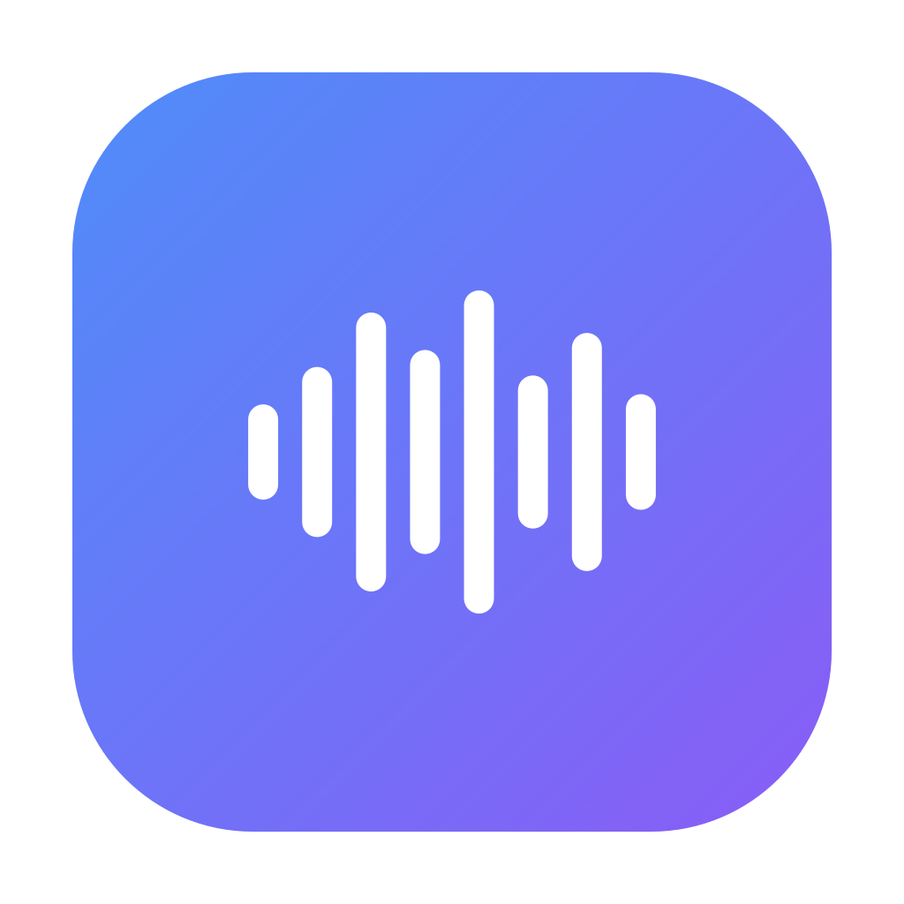

# Dictify

Офлайн-расшифровка аудио и видео в текст для macOS (Apple Silicon) и Windows. Упрощённый аналог MacWhisper.

*Offline audio/video transcription for macOS (Apple Silicon) and Windows, powered by Whisper.*



## Возможности

- Любой аудио- или видеофайл на входе: mp3, wav, m4a, flac, ogg, opus, mp4, mov, mkv, webm и т. д. Декодирование через FFmpeg, встроенный в PyAV.
- Распознавание полностью на компьютере, моделями Whisper от Tiny до Large v3. Модель скачивается при первом использовании.
  - **Mac (Apple Silicon):** [mlx-whisper](https://github.com/ml-explore/mlx-examples), расчёт на GPU через Metal.
  - **Windows:** [faster-whisper](https://github.com/SYSTRAN/faster-whisper), CPU или NVIDIA GPU (CUDA). Библиотеки для видеокарты программа докачивает сама по кнопке.
- Английский, русский и ещё 90+ языков, с автоопределением языка.
- Одно окно. Справа панель настроек (модель, язык и т. д. можно выбрать до загрузки файла), вся область текста — зона перетаскивания. Бросил файл — сразу начинается распознавание, текст появляется по мере готовности, прогресс в панели.
- Своя шапка окна: на Windows вместо системного заголовка (с сохранением тени, Aero Snap и ресайза), на macOS содержимое под прозрачным заголовком с родными кнопками окна.
- Два режима отображения: **сплошной текст** (без таймкодов, с абзацами по паузам или одним блоком) и **сегменты** (строки с таймкодами).
- Настройки вида: таймкоды вкл/выкл и время окончания (для сегментов), длина абзаца и порог паузы (для сплошного текста), размер шрифта.
- Встроенный плеер подсвечивает каждое звучащее слово (караоке, по пословным таймкодам Whisper). В паузе подсветка остаётся на последнем сказанном слове, а начало слова после паузы уточняется по громкости звука. Клик по слову запускает воспроизведение с этого слова, в том числе во время распознавания. Скорость 0.5–2×.
- Поиск по тексту с подсветкой всех совпадений.
- Редактирование текста. Таймкоды защищены от случайной правки.
- Экспорт в TXT, Markdown, SRT, Word (DOCX), PDF. Кнопка «Копировать» копирует весь текст, а в режиме чтения можно выделить и скопировать любой фрагмент.
- Выбранная модель загружается в память сразу после запуска и остаётся загруженной, пока программа открыта, поэтому распознавание начинается без ожидания «Загрузка модели». Простаивающая модель не нагружает процессор, она только занимает память (примерно её размер из таблицы ниже).
- Интерфейс на английском (по умолчанию) и русском, светлая и тёмная темы (по системной). Анимации короткие и не мешают чтению; при системной настройке «уменьшить движение» сдвиги и прокрутка становятся мгновенными.

## Установка (для пользователей)

Готовые сборки лежат в [Releases](https://github.com/smeshidojoe/Dictify/releases), а свежие сборки с каждого коммита во вкладке [Actions](https://github.com/smeshidojoe/Dictify/actions) (артефакты `Dictify-macOS-arm64` / `Dictify-Windows-x64`).

### macOS

1. Скачайте `Dictify-macOS-arm64.dmg` и перетащите Dictify в «Программы».
2. Приложение не подписано сертификатом Apple, поэтому при первом запуске macOS его заблокирует. Откройте **Системные настройки → Конфиденциальность и безопасность** и нажмите **«Всё равно открыть»**. Другой способ — выполнить в Терминале:
   ```bash
   xattr -dr com.apple.quarantine /Applications/Dictify.app
   ```

Нужен Mac с чипом M1 или новее и macOS 13.5+.

### Windows

Распакуйте `Dictify-Windows-x64.zip` и запустите `Dictify\Dictify.exe`. SmartScreen может предупредить о неизвестном издателе: «Подробнее → Выполнить в любом случае».

Если в компьютере есть видеокарта NVIDIA, в боковой панели появится карточка «Быстрее на видеокарте». Кнопка «Скачать» один раз загружает библиотеку NVIDIA cuBLAS (~550 МБ). После этого распознавание идёт на видеокарте: на RTX 3050 модель Large v3 Turbo работает примерно в 13 раз быстрее, чем на процессоре. Нужен драйвер NVIDIA с поддержкой CUDA 12 (версия 527 или новее).

Библиотеки берутся прямо из официального пакета NVIDIA на PyPI (`nvidia-cublas-cu12`). Скачиваются только два нужных файла, их контрольные суммы сверяются с зашитыми в программу. Лежат они в `%LOCALAPPDATA%\Dictify\cuda` и удаляются кнопкой «…» рядом с выбором модели. Если загрузка прервалась, она продолжится с того же места.

## Модели

| Модель | Размер | Комментарий |
|---|---|---|
| Tiny | 75 MB | очень быстро, низкое качество |
| Base | 145 MB | |
| Small | 485 MB | |
| Medium | 1.5 GB | |
| **Large v3 Turbo** | 1.6 GB | рекомендуется: почти как Large v3, но в разы быстрее |
| Large v3 | 3.1 GB | максимальная точность, медленно |

Модели хранятся здесь:
- macOS: `~/Library/Application Support/Dictify/models`
- Windows: `%LOCALAPPDATA%\Dictify\models`

Удалить скачанные модели можно кнопкой «…» рядом с выбором модели. Если Hugging Face недоступен, задайте зеркало переменной окружения `HF_ENDPOINT`.

Логи лежат в папке `logs` рядом с моделями. Открыть её можно кнопкой «Логи» внизу боковой панели.

## Горячие клавиши

| | |
|---|---|
| Пробел | воспроизведение / пауза (в режиме чтения) |
| ← / → | перемотка ±5 с |
| Клик по слову | воспроизведение с этого слова |
| Ctrl/Cmd + O | открыть файл |
| Ctrl/Cmd + E | режим редактирования, Esc — выйти |
| Ctrl/Cmd + F | поиск, Enter / Shift+Enter — следующее / предыдущее |
| Ctrl/Cmd + Shift + C | скопировать весь текст |

## Разработка

Нужен Python 3.12 (подходит и 3.10–3.13).

**Windows:**
```bash
python -m venv .venv
.venv\Scripts\pip install -r requirements-win.txt -r requirements-dev.txt
.venv\Scripts\python -m dictify
```

**macOS (Apple Silicon):**
```bash
python3 -m venv .venv
.venv/bin/pip install -r requirements-mac.txt -r requirements-dev.txt
.venv/bin/pip install --no-deps mlx-whisper==0.4.3
.venv/bin/python -m dictify
```
mlx-whisper ставится с `--no-deps`: в его зависимостях есть torch, numba и scipy. Dictify заменяет нужные функции numba и scipy своими на numpy (`dictify/align.py`), поэтому эти ~200 МБ в сборку не попадают.

**Тесты:**
```bash
python -m pytest
```

### GPU на Windows

В среде разработки cuBLAS можно поставить через pip, а можно скачать кнопкой в самой программе:
```bash
.venv\Scripts\pip install -r requirements-gpu.txt
```
CTranslate2 нужен только cuBLAS: загрузчик cuDNN уже лежит в его пакете, а остальные библиотеки cuDNN Whisper не использует. В режиме «Автоматически» Dictify сам попробует GPU, а если не получится, перейдёт на CPU. Чтобы перейти на другую версию cuBLAS, нужно заново сгенерировать таблицу `PARTS` в `dictify/gpu.py` скриптом `tools/cuda_parts.py`.

### Сборка

```bash
pyinstaller --noconfirm Dictify.spec
```
Результат: `dist/Dictify/` (Windows) или `dist/Dictify.app` (macOS). Собирать нужно на той ОС, для которой нужна сборка. Mac-версию собирает GitHub Actions на раннере `macos-14` (Apple Silicon).

Собранное приложение проверяется самотестом без интерфейса:
```bash
Dictify --selftest sample.wav out-dir tiny
```
Самотест скачивает модель, распознаёт файл, создаёт окно offscreen, загружает медиа в плеер, экспортирует все форматы и пишет `out-dir/selftest.json`. CI запускает его на обеих платформах с речью, сгенерированной TTS. Так Mac-сборка проверяется без Mac под рукой.

Выпустить релиз: создать тег `vX.Y.Z` и сделать push. CI соберёт оба варианта и приложит их к GitHub Release.

## Устройство

```
dictify/
  app.py           точка входа, логирование, открытие файлов из Finder
  audio.py         декодирование любого файла в 16 кГц моно (PyAV)
  catalog.py       список моделей, докачиваемая загрузка с Hugging Face
  engines.py       faster-whisper / mlx-whisper за общим интерфейсом
  gpu.py           докачка cuBLAS для видеокарт NVIDIA (Windows) из официального пакета на PyPI
  worker.py        распознавание в отдельном процессе: модель загружается заранее и остаётся в памяти,
                   «Отмена» мгновенно убивает процесс; загрузка → декодирование → распознавание
  timing.py        уточняет начало слов после пауз по энергии звука
  ui/chrome.py     своя шапка окна (Windows: WinAPI без системного заголовка; macOS: прозрачный заголовок)
  formatting.py    абзацы, таймкоды, TXT/Markdown/SRT
  exporters.py     DOCX (python-docx), PDF (Qt)
  i18n.py          русский словарь интерфейса
  align.py         DTW и медианный фильтр на numpy для пословных таймкодов mlx-whisper
  selftest.py      проверка собранного приложения
  ui/              PySide6: окно, рабочая область, редактор, плеер, выезжающая панель
```

Каждый символ текста в редакторе (`ui/editor.py`) хранит номер своего сегмента в свойстве формата. Поэтому правки, клики по тексту и подсветка при воспроизведении однозначно привязаны к таймкодам при любой раскладке абзацев.
